
<h1 align="center">医院交互系统+vue</h1>

## 简介
医院交互系统：角色分为管理员、用户；功能包括公告管理、预约功能、医生信息管理、用户信息管理、病历和医嘱管理，支持搜索、筛选、审核与详细信息查看。    --计算机毕业设计源码；毕设源码；java毕业设计源码

## 联系方式

<h3 align="center">获取完整代码与数据库文件 + 微信：deepguan QQ: 86050149 QQ群: 783742310</h3>

<h3 align="center">可帮忙远程部署 包运行成功！提供远程部署、修改代码、设计文档指导、代码讲解等服务！</h3>

## 功能介绍（完整见运行截图）
管理员：管理员功能包括登录、退出和注册操作。系统允许管理员管理后台，可对医生、用户和病例进行管理，支持对预约进行审核，管理用户信息，并可以修改系统设置。病历、医嘱等内容也在管理范围内，方便高效地对医院内数据进行系统化管理。

医生：医生可通过系统查看个人资料，更新个人信息如头像和联系方式。系统支持医生查看和管理自己的预约挂号信息，并能对患者病例进行编辑以提供更准确的医疗服务。

用户：用户可以注册与登录系统查看个人中心，包括个人信息管理。用户能够预约医生，并查看和管理自己的预约记录。个人中心还支持用户账户的相关信息修改，如更新联系方式或密码管理。

病患：病患通过系统可以预约挂号，与医生进行联系，查看个人病例及医嘱信息。患者能够在个人中心管理自己的健康信息，提升就医的便利性和效率。

## 运行截图
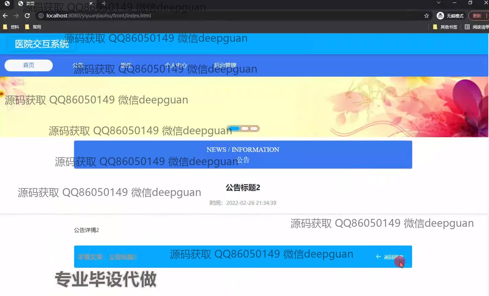
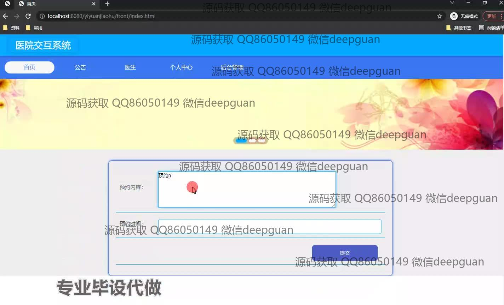
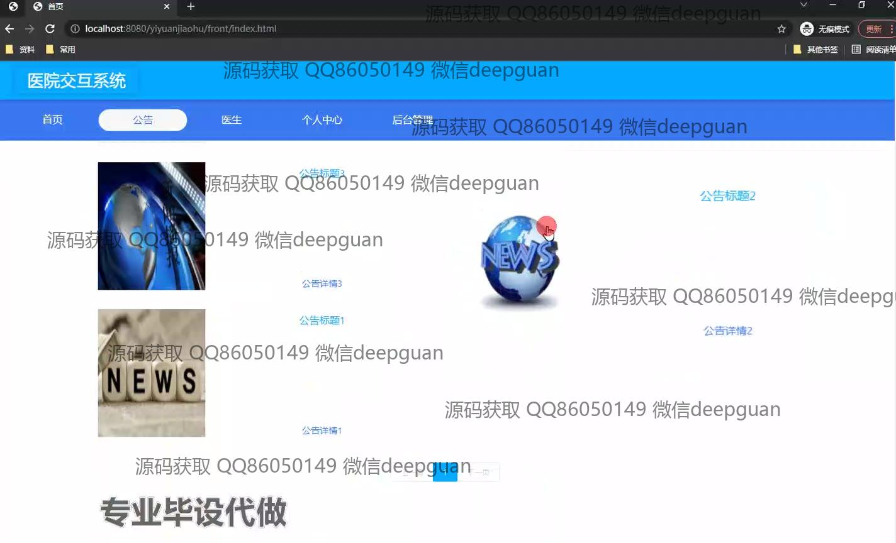
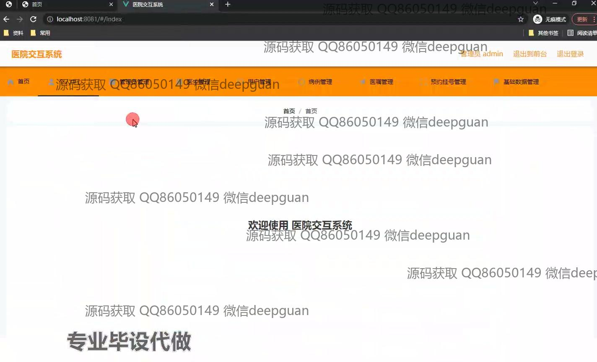
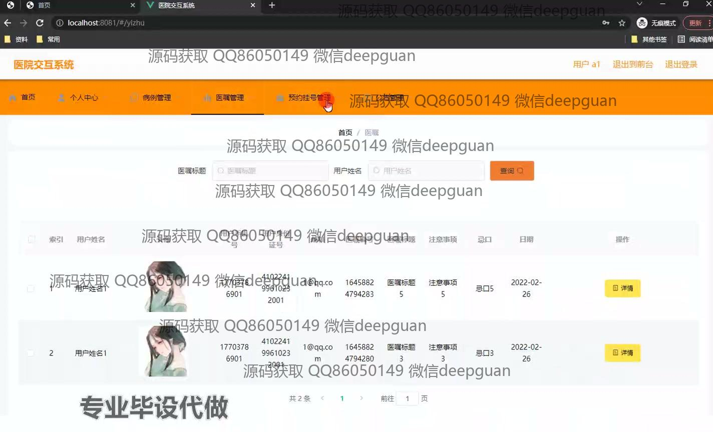
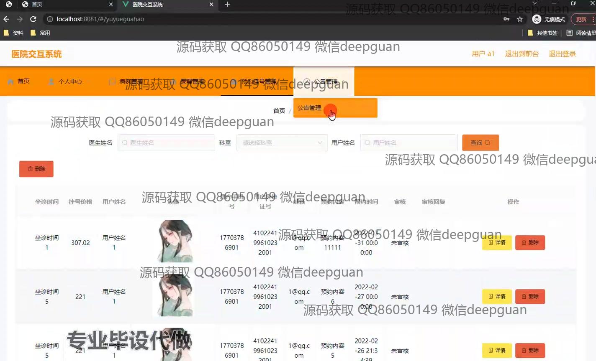
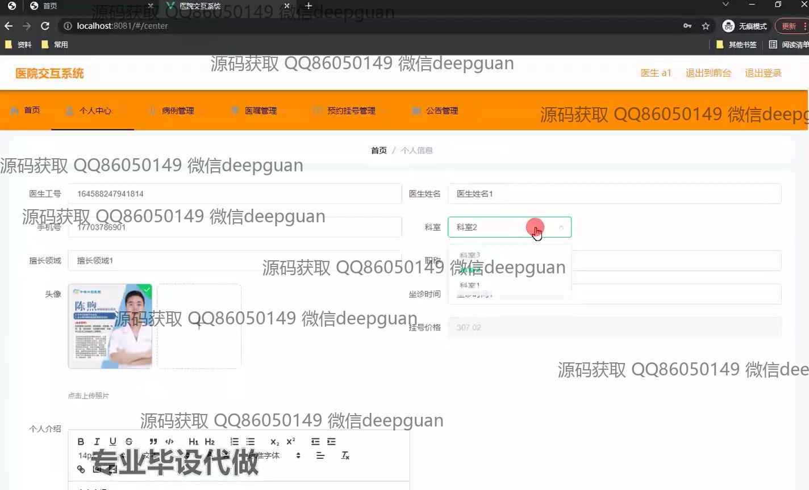
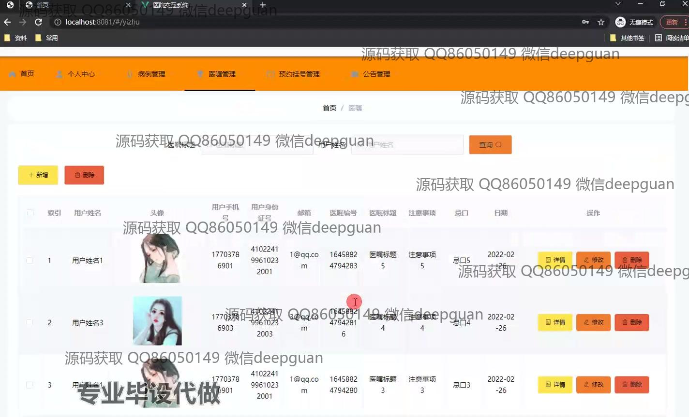
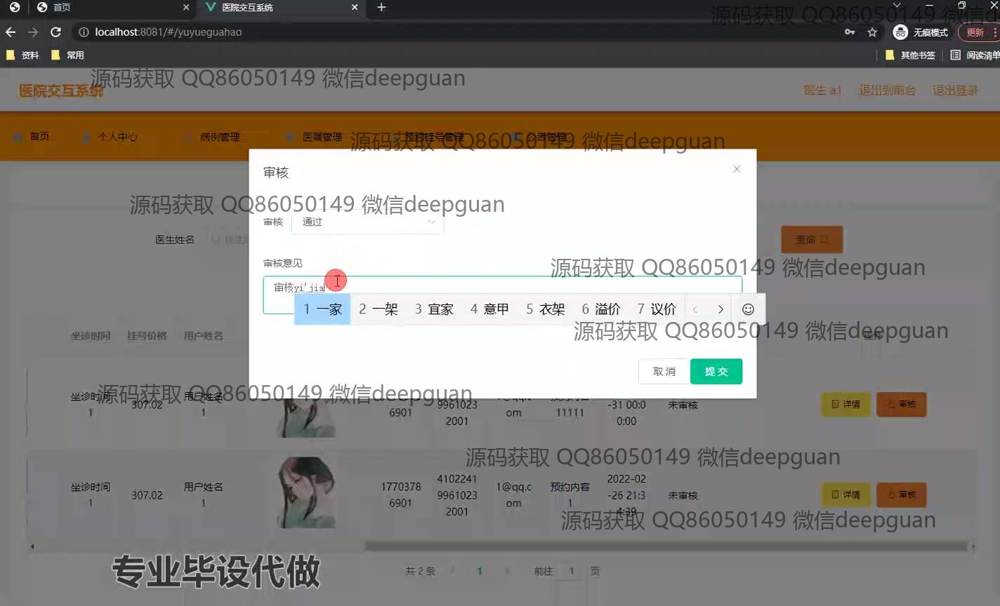
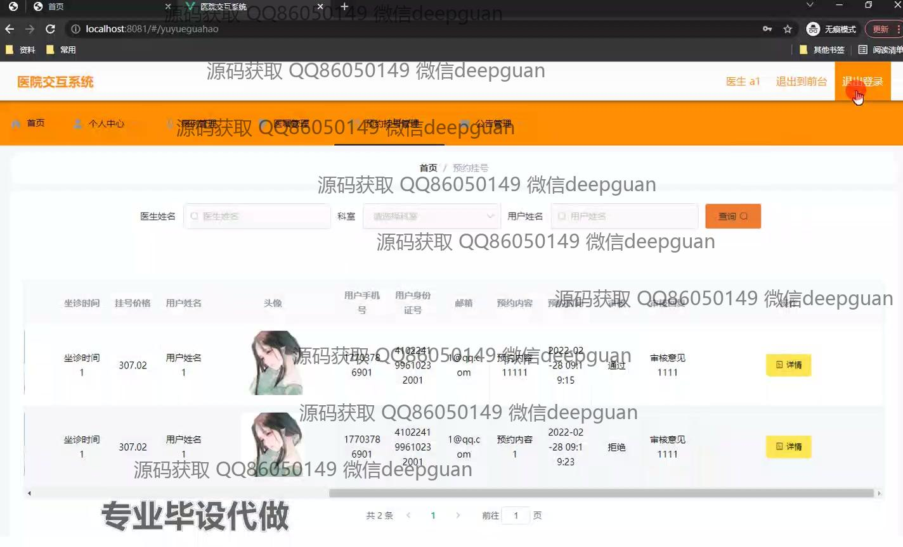
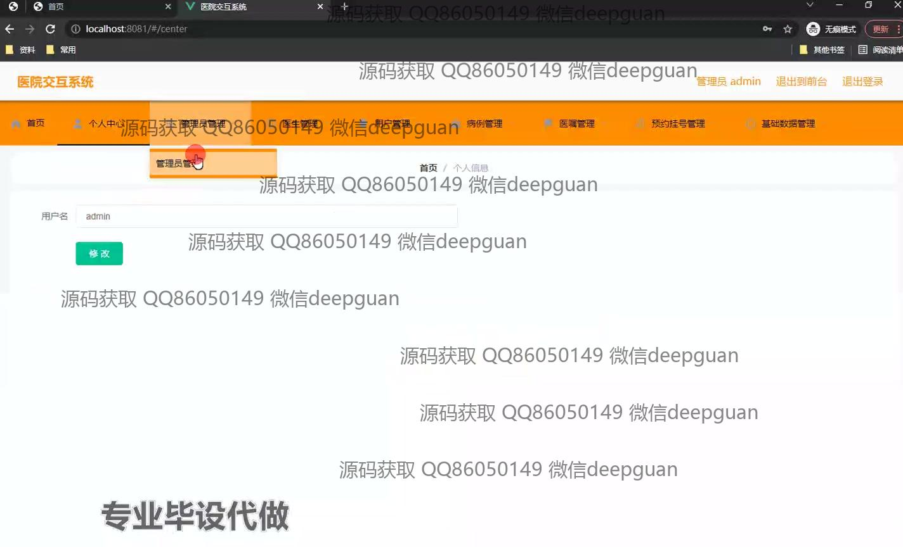
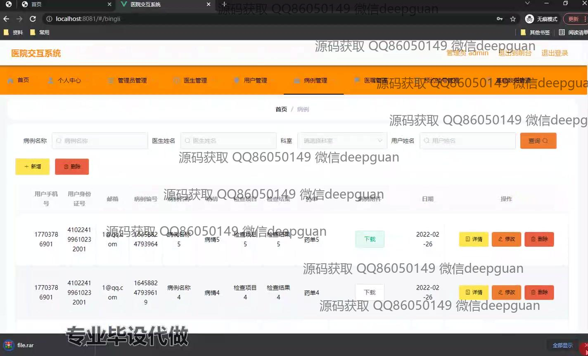
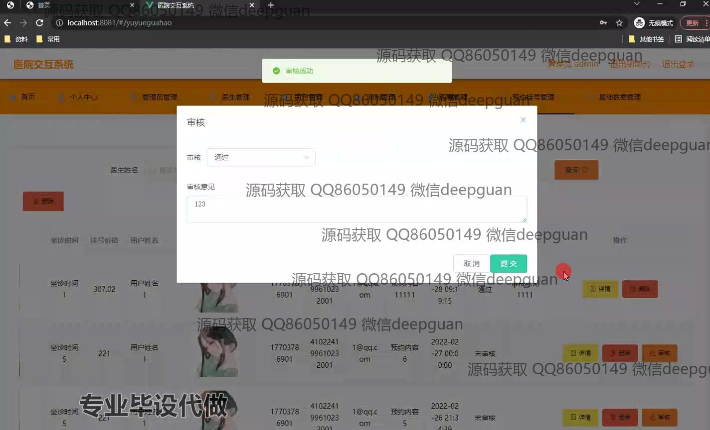

本代码来源于网络,仅供学习参考使用!

